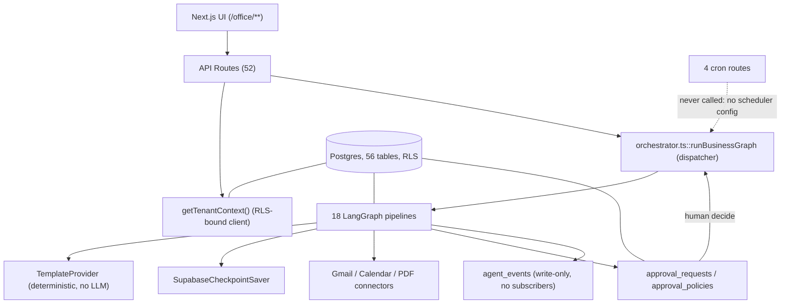
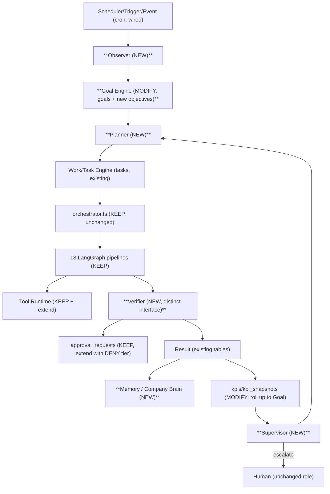

# 15 — Target Architecture & Dependency Map

## 15.1 The target Closed Loop

```
Scheduler / Trigger / Event
        │
        ▼
     Observer  ──────────────────────────────────────────┐
        │   (reads: KPI gap, stuck work, SLA breach,      │
        │    new event, elapsed time)                     │
        ▼                                                 │
   Goal Engine  (company Objective/Goal + current KPI)     │
        │                                                 │
        ▼                                                 │
     Planner  (Goal + Gap → Objective → Project → Work → Task → Action)
        │                                                 │
        ▼                                                 │
   Work Engine → Task Engine                               │
        │                                                 │
        ▼                                                 │
   Agent Runtime  (existing 18 LangGraph pipelines, dispatched by name — KEEP)
        │                                                 │
        ▼                                                 │
   Tool Runtime  (existing Gmail/Calendar/PDF connectors, + new ones — KEEP + EXTEND)
        │                                                 │
        ▼                                                 │
    Verifier  (NEW — distinct from Generator; deterministic checks first)
        │                                                 │
        ▼                                                 │
     Result                                                │
        │                                                 │
        ▼                                                 │
     Memory  (NEW — Company Brain + per-employee/decision memory)
        │                                                 │
        ▼                                                 │
      KPI  (existing kpis/kpi_snapshots — MODIFY to also roll up to company Goal)
        │                                                 │
        ▼                                                 │
   Supervisor  (NEW — watches Progress/Delay/Failure/Quality/Cost/Workload/Approval)
        │                                                 │
        └──────────────────► back to Planner ─────────────┘
```

Human-in-the-loop is preserved exactly where it exists today: the Verifier can require human Approval before a Result is accepted (reusing `approval_requests`/`approval_policies` unchanged), and the Supervisor's job is specifically to escalate to a human rather than to silently retry forever.

## 15.2 What already exists vs. what's new, mapped onto the loop

| Loop stage | Current asset | Verdict |
|---|---|---|
| Scheduler/Trigger/Event | 4 real cron routes; `agent_events`/`eventTypes.ts` taxonomy | **MODIFY** — wire scheduling config; add real subscribers to at least `KPI_CHANGED`, `TASK_FAILED`, `APPROVAL_REQUIRED` |
| Observer | *(none)* | **MISSING — NEW** |
| Goal Engine | `goals`/`kpis` (project-scoped only) | **MODIFY** — add company-level `objectives`, link `goals` upward |
| Planner | *(none — `runBusinessGraph` is a dispatcher, not a planner)* | **MISSING — NEW** |
| Work Engine / Task Engine | `tasks`, `initiatives`, `deliverables`, `execution_graph`'s task-queue loop | **KEEP**, feed it from the new Planner instead of only from `onboarding_graph` |
| Agent Runtime | 18 LangGraph pipelines + `orchestrator.ts` dispatch + `checkpointer.ts` | **KEEP unchanged** — this is real, tested, working infrastructure |
| Tool Runtime | Gmail/Calendar connectors, PDF/PPTX generation | **KEEP + EXTEND** (add real search/CRM/analytics connectors over time) |
| Verifier | Critic nodes inside graphs (mixed quality — see `14_ROOT_CAUSE_ANALYSIS.md` Chain 3) | **MODIFY/REPLACE** — extract into a distinct interface, reuse the 2 good rule-checkers as the template |
| Result | `agent_runs.output`, `deliverables`, `findings` | **KEEP** |
| Memory | `decision_memories` (narrow, disconnected) | **MODIFY + NEW** — keep as one input; add a real Company Brain + per-employee memory |
| KPI | `kpis`/`kpi_snapshots` | **MODIFY** — roll up to company Goal |
| Supervisor | *(none)* | **MISSING — NEW** |

## 15.3 Dependency map (current, as-built)



**No circular dependency was found** at the graph level (`05_AGENT_RUNTIME_AUDIT.md` §5.7): every cross-graph chain is one-directional and terminates. The dotted line above is the one broken edge in the current system — cron routes exist but nothing exercises that path.

## 15.4 Dependency map (target, additions in bold)



## 15.5 Design principle carried through every new component

Every NEW component above is designed to sit **beside** the existing dispatcher, not replace it — `orchestrator.ts::runBusinessGraph` keeps being called exactly as it is today; the new Planner simply becomes one more caller of it (alongside the existing human-triggered API routes), and the new Verifier/Supervisor read the same `workflow_runs`/`agent_events`/`approval_requests` tables that already exist. This is the Strangler Pattern required by `16_MIGRATION_PLAN.md` §16.1 — nothing existing is deleted or rewritten to make room for autonomy.
