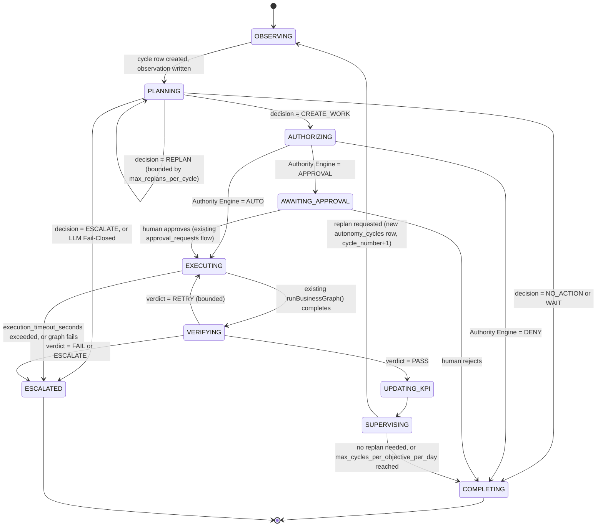

# PHASE 1 — Implementation Plan v3 (AUTHORIZED — implementation in progress)

Status: **AUTHORIZED FOR IMPLEMENTATION.** All architecture/schema/service-boundary/migration-strategy decisions below, including the 7 FINAL CHANGEs, are approved. This document is now updated incrementally as implementation proceeds (per-step, not batched) rather than being a pre-implementation approval gate.

## Confirmed decisions (from v1, final)

1. **KPI**: extend existing `kpis` additively (not a new `objective_kpis` table).
2. **LLM Provider**: no new SDK dependency; raw `fetch` to the Anthropic Messages API, matching the Gmail/Calendar connector precedent.
3. **Work**: new, separate `works` table — do not repurpose `initiatives`.
4. **DENY**: Hard DENY adopted, **unconditionally override-proof, including for superuser roles**.
5. **Approval**: reuse and extend the existing Approval Engine (`approval_requests`/`approval_policies`/`decideApproval()`).

## FINAL CHANGEs (v3, authorized)

1. **Result / Impact Layer**: Execution success ≠ KPI change. A new `ImpactAssessor` component classifies verified Results as `DIRECT_KPI_CHANGE` / `INDIRECT_CONTRIBUTION` / `NO_MEASURABLE_CHANGE` / `UNKNOWN`. `UPDATING_KPI` only happens for `DIRECT_KPI_CHANGE` and is safely skippable otherwise. State machine gains `COMMITTING_RESULT` and `ASSESSING_IMPACT` stages (§4, revised below).
2. **Source of Truth**: `autonomy_cycles`/`works`/`workflow_runs` (DB) are the only Source of Truth for autonomy state. AI Office is a **read-only projection** of it — never a second state store. No component may infer autonomy state from UI-layer code.
3. **State Transition Validation**: no service writes `autonomy_cycles.status`/`works.status` directly. All transitions go through one `transitionCycle()` / `transitionWork()` service (`lib/autonomy/stateTransition.ts`) that whitelists legal transitions and rejects the rest (e.g. `COMPLETED→EXECUTING`, `ESCALATED→PLANNING`, `DENIED→EXECUTING`).
4. **Terminal States**: `COMPLETED`, `ESCALATED`, `CANCELLED`, `BLOCKED`, `FAILED`, `DENIED` are terminal for both cycles and works — `transitionCycle()`/`transitionWork()` refuse any transition *out of* a terminal state; resuming means a new cycle or an explicit Retry/Resume operation, never an implicit reopen.
5. **Human Intervention Trace**: every human Approve/Reject/Pause/Resume/Cancel/Override writes a `decision_logs` row with `actor` (user id, not "AI"), `action`, `reason`, `timestamp`, `cycle_id` — added as required (not optional) columns on `decision_logs`.
6. **Planner Confidence**: `plan_proposals.confidence` is observation/analytics metadata only. `AuthorityEngine.evaluate()` never reads `confidence` as an input — confirmed by construction (the function signature does not accept it).
7. **No Silent Failure**: every stage (Planner/Provider/Skill resolution/Assignee resolution/Authority/Cost reservation/Execution/Verification/Impact assessment/KPI update/Supervisor) failure is caught, written to `decision_logs`+`agent_events`, and transitions the cycle/work via `transitionCycle()`/`transitionWork()` to one of `RETRY`/`WAIT`/`BLOCKED`/`ESCALATED`/`FAILED` — never swallowed.

---

## 1. Revised architecture (headline change from v1)

v1 had the Planner propose a Work and mark it `requiresApproval`, with the Execution Adapter acting on that flag more or less directly. **This is no longer the design.** The corrected pipeline, per CHANGE 3/6/7, is:

```
Objective ──► Autonomy Cycle (trace root, created first)
                 │
                 ▼
          ObjectiveObserver ──► ObjectiveObservation
                 │
                 ▼
      SkillCandidateResolver ──► candidate Skills (filtered, not the full Registry)
                 │
                 ▼
          CompanyPlanner ──► PlanProposal { decision: NO_ACTION|CREATE_WORK|REPLAN|ESCALATE|WAIT }
                 │                                            (decision ≠ CREATE_WORK ⇒ cycle ends here, successfully)
                 ▼ (CREATE_WORK only)
               Work (status=PROPOSED, assignee=SYSTEM_ASSIGNEE for now)
                 │
                 ▼
        Authority Engine  ◄── approval_policies (incl. hard_deny) — INDEPENDENT of Planner's advisory flag
                 │
        ┌────────┼────────┐
        ▼        ▼        ▼
      DENY     APPROVAL   AUTO
    (final,   (existing   (proceed)
   no override) approval_requests)
                 │
                 ▼ (AUTO or human-approved only)
         AssigneeResolver ──► (PHASE 1: always SYSTEM_ASSIGNEE)
                 │
                 ▼
         Execution Adapter ──► existing runBusinessGraph() (UNCHANGED) ──► one of the 18 existing graphs
                 │
                 ▼
            ResultVerifier ──► PASS/FAIL/RETRY/ESCALATE
                 │
                 ▼
         KPI update (existing kpi_snapshots writes, unchanged)
                 │
                 ▼
         CompanySupervisor ──► requests next Autonomy Cycle, or stops
```

The key correction: **the Planner never has execution authority.** Its `plannerSuggestedRequiresApproval` field is advisory metadata only, logged for audit, and cannot upgrade or downgrade what the Authority Engine decides. A Hard-DENY policy blocks execution even if the Planner (or an LLM) judged the action safe. This directly implements CHANGE 3 and hardens CHANGE 4 from v1 ("Hard DENY... 実行不可").

## 2. Schema — final proposal (all additive; supersedes v1 §2-3)

### 2.1 New tables

**`objectives`** — unchanged from v1: `id, tenant_id, title, description, objective_type, target_value, current_value, unit, start_date, deadline, priority, status(DRAFT/ACTIVE/AT_RISK/ACHIEVED/PAUSED/CANCELLED), owner_type, owner_id, created_by, created_at, updated_at`.

**`autonomy_cycles`** — **now the trace root** (created *before* the Observation, per CHANGE 5, not just a Supervisor bookkeeping table as in v1):
```
id, tenant_id, objective_id, cycle_number int,
status text default 'RUNNING' check in ('RUNNING','COMPLETED','FAILED','ESCALATED'),
triggered_by text check in ('SCHEDULER','MANUAL','SUPERVISOR_REPLAN'),
started_at, ended_at, outcome text,
created_at
unique (tenant_id, objective_id, cycle_number)
```

**`objective_observations`** — as v1, `cycle_id uuid not null references autonomy_cycles(id)` (was nullable in v1; now mandatory since the cycle always exists first).

**`plan_proposals`** — revised per CHANGE 2/12/13:
```
id, tenant_id, objective_id, cycle_id not null, observation_id,
decision text not null check in ('NO_ACTION','CREATE_WORK','REPLAN','ESCALATE','WAIT'),
reasoning_summary text not null,
reason_codes text[] not null default '{}',
proposed_works jsonb not null default '[]',  -- empty unless decision='CREATE_WORK'
expected_impact text,
candidate_skill_ids uuid[] not null default '{}',
estimated_cost numeric,
confidence numeric,
recommended_next_observation_at timestamptz,
planner_suggested_requires_approval boolean not null default false,  -- ADVISORY ONLY, see §1
provider_kind text not null check in ('REAL','MOCK','SIMULATED'),  -- CHANGE 1: always visible
status text not null default 'RECORDED',
created_at
```

**`works`** — revised per CHANGE 3/7/11:
```
id, tenant_id, objective_id, plan_proposal_id, cycle_id not null, skill_definition_id,
title, description,
assignee_type text not null default 'SYSTEM' check in ('SYSTEM','AI_EMPLOYEE'),
assignee_ref text not null default 'SYSTEM_ASSIGNEE',
expected_outcome, priority,
status text not null default 'PROPOSED' check in
  ('PROPOSED','AUTHORITY_PENDING','APPROVED','DENIED','EXECUTING','COMPLETED','FAILED','BLOCKED','CANCELLED'),
authority_decision text check in ('AUTO','APPROVAL','DENY'),  -- set ONLY by the Authority Engine, never by Planner
authority_policy_code text,
estimated_cost, deadline,
idempotency_key text not null,
created_at, updated_at
unique (tenant_id, idempotency_key)          -- CHANGE 11: real DB constraint, not app-check-then-insert
unique (tenant_id, observation_id, skill_definition_id)  -- belt-and-suspenders: same observation can't spawn 2 works for the same skill
```
`idempotency_key` = a deterministic hash of `(tenant_id, objective_id, observation_id, skill_definition_id, cycle_id)`, computed the same way as the existing `seededScore`/hash utilities already in this codebase — not a new hashing approach.

**`verifications`** — as v1, `cycle_id not null`.

**`cost_reservations`** — **new, per CHANGE 4** (Estimate→Reserve→…→Reconcile/Release state machine):
```
id, tenant_id, cycle_id, work_id,
estimated_cost_usd numeric not null,
status text not null default 'RESERVED' check in ('RESERVED','RECONCILED','RELEASED','EXPIRED'),
reserved_at timestamptz not null default now(),
reconciled_at timestamptz,
actual_cost_usd numeric,
created_at
```

**`execution_costs`** — as v1, but now `reservation_id uuid references cost_reservations(id)` added, holding the per-call provider/model/token/actual-cost detail that a reservation reconciles against.

**`decision_logs`** — as v1, `cycle_id not null`.

**`tenant_autonomy_settings`** — substantially expanded per CHANGE 9/10:
```
tenant_id (pk),
feature_enabled boolean not null default false,
autonomy_mode text not null default 'OFF' check in ('OFF','SHADOW','ASSISTED','ACTIVE'),
emergency_stop boolean not null default false,          -- CHANGE 10, Kill Switch
per_execution_cost_limit_usd numeric,
per_cycle_cost_limit_usd numeric,
daily_cost_limit_usd numeric,
max_works_per_cycle int not null default 1,
max_tasks_per_work int not null default 10,
max_cycles_per_objective_per_day int not null default 4,   -- CHANGE 9
max_replans_per_cycle int not null default 1,               -- CHANGE 9
cooldown_after_execution_minutes int not null default 30,   -- CHANGE 9
duplicate_work_window_minutes int not null default 60,      -- CHANGE 9
planner_timeout_seconds int not null default 30,            -- CHANGE 9
execution_timeout_seconds int not null default 300,         -- CHANGE 9
updated_at
```

**`skill_definitions`** — unchanged from v1.

### 2.2 Modified existing tables (additive columns only — unchanged from v1, confirmed)

`kpis` (+`objective_id`, `project_id` now nullable) · `tasks` (+`work_id` nullable, +`cycle_id` nullable — added per CHANGE 5's requirement that Task also be traceable) · `workflow_runs`/`agent_events`/`approval_requests` (+`cycle_id` nullable) · `approval_policies` (+`hard_deny boolean not null default false`).

## 3. Service / Interface — final list

| Component | File | Change from v1 |
|---|---|---|
| `ObjectiveObserver` | `lib/autonomy/observer.ts` | Now also creates the `autonomy_cycles` row first (trace root), and enforces `max_cycles_per_objective_per_day`/`cooldown_after_execution_minutes` before starting one |
| `SkillCandidateResolver` | `lib/autonomy/skillCandidateResolver.ts` | **NEW (CHANGE 6)** — rule-based filter (department, `enabled`, risk tier) between Registry and Planner; queries by indexed columns so it stays cheap at 1000+ skills, not a full-table load |
| `CompanyPlanner` | `lib/autonomy/planner.ts` | Now must emit a `decision` (§4); calls `LLMProvider` only via the Fail-Closed gate (§7); does **not** decide Authority — only advisory `plannerSuggestedRequiresApproval` |
| `AuthorityEngine` | `lib/autonomy/authorityEngine.ts` | **NEW (CHANGE 3)** — the only component allowed to set `works.authority_decision`; evaluates `approval_policies` (incl. `hard_deny`) independently of the Planner |
| `AssigneeResolver` | `lib/autonomy/assigneeResolver.ts` | **NEW (CHANGE 7)** — PHASE 1: trivially returns `SYSTEM_ASSIGNEE`; exists as an interface boundary so an AI-Employee layer can be inserted later without touching the Execution Adapter |
| Execution Adapter | `lib/autonomy/executionAdapter.ts` | Now calls `AssigneeResolver` first, then wraps `runBusinessGraph()` with `execution_timeout_seconds` (`Promise.race`) |
| `ResultVerifier` | `lib/autonomy/verifier.ts` | Unchanged from v1 |
| `CompanySupervisor` | `lib/autonomy/supervisor.ts` | Now also enforces `max_replans_per_cycle` before requesting `SUPERVISOR_REPLAN` |
| Cost Reservation Service | `lib/autonomy/costGuardrail.ts` | **Redesigned per CHANGE 4**: `reserve()` / `reconcile()` / `release()` instead of v1's after-the-fact sum check (detail in §9) |
| `LLMProvider` (+ typed failures) | `lib/ai/llmProvider.ts`, `lib/ai/anthropicLLMProvider.ts` | **Redesigned per CHANGE 1/14** (detail in §7) |
| Decision Log writer | `lib/autonomy/decisionLog.ts` | Unchanged, now always tagged with `cycle_id` |
| Kill Switch check | `lib/autonomy/killSwitch.ts` | **NEW (CHANGE 10)** — one function, `assertNotStopped(tenantId)`, called at the top of the cron route, the Observer, the Planner, and the Execution Adapter |
| Shared types/schemas | `lib/autonomy/types.ts` | Expanded per CHANGE 12/13 (detail in §5) |

## 4. Autonomy Cycle State Machine



`autonomy_cycles.status` collapses this to `RUNNING` (any state above except the two terminals) / `COMPLETED` (via COMPLETING) / `ESCALATED` / `FAILED` (an unhandled exception at any stage). Every state transition writes one `decision_logs` row (stage + reasoning summary + reason codes) and, where applicable, one `agent_events` row — both tagged with the same `cycle_id`.

## 5. Planner Input / Output contract (CHANGE 12/13)

```ts
// lib/autonomy/types.ts
interface PlannerInput {
  objective: ObjectiveSnapshot;
  kpiSnapshot: KpiSnapshot;
  observation: ObjectiveObservation;
  existingActiveWorks: WorkSummary[];
  recentCompletedWorks: WorkSummary[];   // last N, bounded
  recentFailedWorks: WorkSummary[];      // last N, bounded
  candidateSkills: SkillDefinitionSummary[];  // from SkillCandidateResolver, NOT the full registry
  budgetState: { remainingDailyUsd: number; remainingPerCycleUsd: number };
  authorityConstraints: { maxWorksPerCycle: number; autonomyMode: AutonomyMode };
  autonomyMode: AutonomyMode;
  relevantDecisionSummaries: string[];   // last N reasoning summaries from decision_logs, NOT raw history
}

const PlanProposalSchema = z.object({
  decision: z.enum(["NO_ACTION", "CREATE_WORK", "REPLAN", "ESCALATE", "WAIT"]),
  reasoningSummary: z.string(),
  reasonCodes: z.array(z.string()),
  proposedWorks: z.array(ProposedWorkSchema).default([]),  // must be empty unless decision === "CREATE_WORK" — enforced in code, not just by the LLM
  expectedImpact: z.string().optional(),
  candidateSkillIds: z.array(z.string().uuid()),
  estimatedCost: z.number().nonnegative(),
  confidence: z.number().min(0).max(1),
  recommendedNextObservationAt: z.string().datetime(),
  plannerSuggestedRequiresApproval: z.boolean(),  // ADVISORY ONLY — see §1
});
```

**Explicitly never passed to the Planner**: full conversation history, other tenants' data, raw chain-of-thought from a prior cycle (only its `reasoningSummary` is passed forward, via `relevantDecisionSummaries`).

## 6. Skill / Assignee Resolution (CHANGE 6/7)

- `SkillCandidateResolver.resolve(objective, observation, tenantId)` — PHASE 1 rule: `enabled=true AND (department is null OR department = objective.department) AND risk_level <= tenant's configured ceiling`. Returns a bounded list (e.g. top 20 by a simple relevance score), never the full table — this is the seam that keeps the design correct at 100/500/1000+ skills without a rewrite later.
- `AssigneeResolver.resolve(work)` — PHASE 1: unconditionally returns `{assigneeType: "SYSTEM", assigneeRef: "SYSTEM_ASSIGNEE"}`. The Execution Adapter is written to call this function rather than inlining the constant, so a future `AI_EMPLOYEE` branch (resolving to a real `agents.id` and, later, that employee's own skill preferences) is a change to this one function, not to the Execution Adapter or anything upstream of it.

## 7. LLM Provider — Fail-Closed design (CHANGE 1/14)

```ts
type ProviderKind = "REAL" | "MOCK" | "SIMULATED";  // SIMULATED = TemplateProvider's own outputs, shown for context in the same UI/logs

interface LLMCallResult<T> { data: T; providerKind: ProviderKind; providerId: string; usage?: { inputTokens: number; outputTokens: number } }

interface LLMProvider {
  readonly id: string;
  readonly kind: ProviderKind;
  generateStructured<T>(params: { schema: z.ZodType<T>; prompt: string; system?: string }): Promise<LLMCallResult<T>>;
  generateText(params: { prompt: string; system?: string }): Promise<LLMCallResult<string>>;
}
```

**Selection (`getLLMProvider(tenantAutonomySettings)`)**:
- `autonomyMode` is `OFF`/`SHADOW`, or `NODE_ENV==='test'` → `MockLLMProvider` (kind `MOCK`) — the **only** cases Mock is allowed, per CHANGE 1.
- `autonomyMode` is `ASSISTED`/`ACTIVE` → **must** resolve `AnthropicLLMProvider`. If `ANTHROPIC_API_KEY` is missing, or a preflight reachability check fails, `getLLMProvider()` throws `LLMProviderUnavailableError` — **there is no fallback branch to Mock in this code path.** The Planner catches this specific error and transitions the cycle straight to `ESCALATED` (§4), writing a `decision_logs` row explaining exactly why (fail-closed, not silently degraded).
- Every `plan_proposals` row, every relevant `decision_logs`/`agent_events` row, and the Pilot Dashboard (§30 of the original brief) all display `providerKind` — REAL vs MOCK vs SIMULATED is never ambiguous at any layer.

**Typed failure classification** (`lib/ai/anthropicLLMProvider.ts`):

| Error type | Trigger | Retry policy transition |
|---|---|---|
| `LLMTimeoutError` | request exceeds `planner_timeout_seconds` | `RETRY` (bounded, small fixed count, exponential backoff) |
| `LLMRateLimitError` | HTTP 429 | `WAIT` (respect `Retry-After` if present) |
| `LLMServerError` | HTTP 5xx | `RETRY` (bounded) |
| `LLMNetworkError` | fetch-level failure (DNS, connection reset) | `RETRY` (bounded) |
| `LLMMalformedResponseError` | response isn't valid JSON / doesn't match Anthropic's expected envelope | `ESCALATE` (treated as a persistent issue, not transient) |
| `LLMSchemaValidationError` | valid JSON, but fails the `PlanProposalSchema` zod parse | `ESCALATE` |
| retry budget exhausted for any of the above | — | `BLOCKED` (work/cycle marked `BLOCKED`; Supervisor is notified via the normal `SUPERVISOR_REPLAN_REQUESTED`-adjacent path) |

## 8. Approval / Hard DENY (CHANGE 3/4, finalized)

- `AuthorityEngine.evaluate(work, tenantAutonomySettings)` is the **only** place `works.authority_decision` is set. It looks up the matching `approval_policies` row exactly as `approvalPolicy.ts` does today for existing approval types, plus checks `hard_deny`.
- **`hard_deny = true` ⇒ `authority_decision = 'DENY'`, `works.status = 'DENIED'`, execution never happens, and — per your explicit correction — `authorizeDecision()` in `lib/server/approvals.ts` is updated so the existing `SUPERUSER_ROLES` bypass (`owner`/`ceo`/`admin`) is **not consulted at all** for a hard-denied work; there is no code path, including a superuser API call, that can flip a `DENIED` work back to executable.** This closes PHASE 0's Root Cause Chain 6 completely, not just partially as v1's draft implied.
- `authority_decision = 'APPROVAL'` reuses the existing `approval_requests` table/`decideApproval()` unchanged, with `type = 'work_creation'`, `subject_type='work'`.
- The Planner's `plannerSuggestedRequiresApproval` is stored on `plan_proposals` purely for audit/comparison (e.g. "the Planner thought this was safe, but policy required approval anyway" is itself a useful signal for the Supervisor/human reviewer) — it has zero effect on `AuthorityEngine`'s output.

## 9. Cost Reservation model (CHANGE 4, finalized)

```
ESTIMATE (Planner, before calling the LLM)
   ↓
RESERVE  — costGuardrail.reserve(tenantId, cycleId, estimatedCostUsd)
   │        atomically checks (sum of RESERVED + RECONCILED today/this-cycle) + estimate <= limit,
   │        using a per-tenant-per-day ledger row locked with `select ... for update`
   │        (same transactional-safety idea already used for `background_jobs`' lock row —
   │        no new locking primitive introduced)
   │        → {allowed:false} short-circuits straight to ESCALATED, no LLM call is made
   ↓ (allowed)
EXECUTE  — the LLM call (or, later, a real tool call) actually happens
   ↓
ACTUAL   — real token usage / cost is known
   ↓
RECONCILE — cost_reservations.status='RECONCILED', actual_cost_usd set, matching execution_costs row written
   (or, if the call never ends up happening — e.g. Planner short-circuits to NO_ACTION before spending —
    RELEASE — cost_reservations.status='RELEASED', no actual cost recorded)
```

This directly prevents the race condition v1's simple "sum historical costs" design was vulnerable to: two objectives' Planner cycles running concurrently in the same tenant now serialize on the same per-tenant-per-day ledger row at `reserve()` time, so neither can overspend the daily limit by both passing a stale read of "cost so far."

## 10. Loop Safety (CHANGE 9, finalized)

All seven limits live on `tenant_autonomy_settings` (§2.1) and are enforced at these exact points:

| Limit | Enforced by |
|---|---|
| `max_cycles_per_objective_per_day` | `ObjectiveObserver`, before creating a new `autonomy_cycles` row |
| `max_works_per_cycle` | `CompanyPlanner`, before writing more than N `works` rows from one `plan_proposals.proposed_works` |
| `max_replans_per_cycle` | `CompanyPlanner`, counting `REPLAN` decisions within the same `cycle_id` |
| `cooldown_after_execution_minutes` | `ObjectiveObserver`, comparing `now()` against the objective's last `autonomy_cycles.ended_at` |
| `duplicate_work_window_minutes` | `CompanyPlanner`/`works` idempotency check (§2.1's unique constraints are the hard backstop; this window is the soft, human-tunable version) |
| `planner_timeout_seconds` | wraps the `LLMProvider` call inside `CompanyPlanner` |
| `execution_timeout_seconds` | wraps the `runBusinessGraph()` call inside the Execution Adapter (`Promise.race`) |

**Honest limitation, flagged rather than hidden**: `execution_timeout_seconds` racing against `runBusinessGraph()` means the *caller* stops waiting and marks the Work `FAILED`/`ESCALATED`, but the underlying LangGraph invocation (and its `workflow_runs` row) may still be running server-side — this codebase has no infrastructure to forcibly cancel an in-flight Node async call. This is a known, accepted PHASE 1 limitation (Kill Switch, §11, has the same caveat) and should be revisited once a real queue/worker layer exists (per PHASE 0's `16_MIGRATION_PLAN.md`).

## 11. Kill Switch (CHANGE 10, finalized)

`tenant_autonomy_settings.emergency_stop` (boolean, default `false`). `lib/autonomy/killSwitch.ts::assertNotStopped(tenantId)` is called at the very top of: the `objective-observer` cron handler (per-tenant, before doing anything for that tenant), `ObjectiveObserver`, `CompanyPlanner`, and the Execution Adapter. When `true`: no new `autonomy_cycles` row is created, no new `works` row is created, no new `runBusinessGraph()` call is issued via the autonomy path, and the cron route logs a `SUPERVISOR_REPLAN_REQUESTED`-adjacent skip event rather than silently doing nothing. The Pilot Dashboard (§17 below) exposes this as a single, immediately-effective toggle a human can flip without a deploy — it's a plain DB row update. Same in-flight-execution caveat as §10 applies and is stated there, not hidden here.

## 12. Idempotency (CHANGE 11, finalized)

`works` carries **two** real DB constraints (not application-level check-then-insert, which is race-prone under concurrent Planner/Observer runs): `unique(tenant_id, idempotency_key)` and `unique(tenant_id, observation_id, skill_definition_id)`. `idempotency_key` is computed from `(tenant_id, objective_id, observation_id, skill_definition_id, cycle_id)` using the same deterministic hashing approach already used elsewhere in this codebase (`seededScore`-style), so a retried or duplicated Planner invocation for the same observation fails the insert (caught and treated as "already handled," not as an error) rather than silently creating a second Work. This mirrors — and is stricter than — the existing `sales_messages.idempotency_key` precedent.

## 13. 2-Cycle Vertical Slice (CHANGE 8, finalized)

**PHASE 1 is not considered proven by a single successful execution.** The Integration Test and the real pilot rollout must both reproduce:

- **Cycle 1**: Objective (KPI gap on a real project) → `ObjectiveObserver` (via `lib/server/measurement.ts`'s existing gap logic) → `SkillCandidateResolver` → `CompanyPlanner` decides `CREATE_WORK` → Authority Engine evaluates (Shadow: recorded only; Assisted: `APPROVAL` → human approves) → Execution Adapter calls the existing `measurement_graph`/`renewal_graph` unchanged → `ResultVerifier` PASS → `kpi_snapshots` updated → `CompanySupervisor` sees the objective is still `AT_RISK` (deliberately, for the test) → requests cycle 2.
- **Cycle 2**: new `autonomy_cycles` row (`cycle_number=2`) → `ObjectiveObserver` reads the *updated* KPI state from Cycle 1 → `CompanyPlanner` must reach a **different** decision than Cycle 1 given the changed input (e.g. `WAIT` if the metric is now trending correctly with `recommendedNextObservationAt` set, or `CREATE_WORK` again with different `proposedWorks` if still off-track, or `ESCALATE` if a guardrail was hit) → if `CREATE_WORK`, repeats Authorize→Execute→Verify→KPI-update; if `WAIT`/`NO_ACTION`, the cycle completes with **no execution**, which the test asserts is a *successful*, not a failed, outcome.

The Closed-Loop integration test (`lib/autonomy/closedLoop.integration.test.ts`) encodes exactly this two-cycle script against `fakeSupabase` + `MockLLMProvider` (deterministic per-cycle inputs producing the two different decisions above), and is the concrete artifact that proves §15's Success Criteria — "one execution" alone does not close this test.

## 14. Test Strategy (supersedes v1 §12)

All of v1's planned test files remain, plus, driven by the CHANGEs above:

`lib/autonomy/authorityEngine.test.ts` (hard_deny is unconditional — attempt override as every role including owner/ceo/admin, assert all fail identically; Planner's advisory flag is proven to have zero effect on the outcome) · `lib/autonomy/skillCandidateResolver.test.ts` (filtering correctness; a synthetic 1000-skill fixture proves the query stays index-driven, not an in-memory full scan) · `lib/autonomy/assigneeResolver.test.ts` (always returns `SYSTEM_ASSIGNEE` in PHASE 1; the function signature is exercised as its own unit so a later `AI_EMPLOYEE` branch is a pure addition) · `lib/ai/llmProvider.test.ts` (Fail-Closed: `ASSISTED`/`ACTIVE` with no API key throws `LLMProviderUnavailableError`, never silently returns Mock; every one of the 6 typed failure classes maps to its documented retry-policy transition) · `lib/autonomy/costGuardrail.test.ts` (Reserve/Reconcile/Release state transitions; a concurrency test spins up two simultaneous `reserve()` calls for two objectives in the same tenant near the daily limit and asserts exactly one succeeds) · `lib/autonomy/killSwitch.test.ts` (with `emergency_stop=true`, assert zero new `autonomy_cycles`/`works`/`runBusinessGraph` calls occur across the cron route, Observer, Planner, and Execution Adapter) · idempotency test (concurrent duplicate Planner output for the same observation → exactly one `works` row, via the real unique constraint, not a race) · the 2-cycle Closed-Loop integration test (§13). Existing 291+ tests: unmodified, green throughout (rule from v1's §38, unchanged).

## 15. Migration order (supersedes v1 §13, Steps 3-11 reordered/expanded)

1. Re-read PHASE 0 + this v2 plan *(done — this document)*
2. `objectives`, `autonomy_cycles`, `kpis` extension, `tenant_autonomy_settings` (incl. Kill Switch + Loop Safety columns from day one, not bolted on later)
3. `killSwitch.ts` (trivial, but wired into every subsequent component from the moment they're written, not retrofitted)
4. `ObjectiveObserver` (writes `objective_observations`, creates `autonomy_cycles` rows)
5. `skill_definitions` + `SkillCandidateResolver`
6. `LLMProvider` abstraction incl. Fail-Closed logic and the 6 typed failure classes (Mock first, real Anthropic adapter same step or immediately after)
7. `CompanyPlanner` (emits `decision`; §5's Input/Output contract)
8. `works` table + `AuthorityEngine` (built together — a Work is never "just created," it's created *and immediately authority-evaluated* in the same transaction/flow)
9. `AssigneeResolver` + Execution Adapter → existing `runBusinessGraph()` (with `execution_timeout_seconds`)
10. `ResultVerifier`
11. `cost_reservations`/`execution_costs` + Cost Reservation Service (must exist **before** step 6's real provider is ever enabled for any tenant — sequencing constraint carried over from v1's Risk R12)
12. `CompanySupervisor` (incl. `max_replans_per_cycle`/cooldown enforcement)
13. `objective-observer` cron route + `vercel.json` (all 5 routes)
14. New `eventTypes.ts` entries
15. `approval_policies.hard_deny` + `authorizeDecision()` update (no superuser bypass path) + new approval types
16. Shadow Mode wiring (Execution Adapter no-ops in `SHADOW`)
17. Pilot Dashboard (incl. the Kill Switch toggle and REAL/MOCK/SIMULATED indicator)
18. 2-Cycle Vertical Slice E2E against a real pilot tenant (Shadow → Assisted)
19. Security/regression pass (tenant isolation on every new table, full existing suite green, hard-deny-cannot-be-overridden test as a named, explicit gate)
20. Documentation

Same rule as v1 §38: `IMPLEMENT → TYPECHECK → LINT → TEST → REVIEW → next step`, every step.

## 16. Files expected to change / to be new

**Changed** (additive edits only, same list as v1 plus): `lib/server/approvals.ts` (now: `authorizeDecision` has a hard-deny short-circuit with **no** superuser branch reachable for it, not just a new condition alongside the old one) · `lib/server/approvalPolicy.ts` · `lib/office/eventTypes.ts` · `components/office/LeftNav.tsx` · `.env.example` · `vercel.json` · `README.md`/`supabase/ER.md`.

**New** (supersedes v1 §15): `supabase/migrations/<ts>_ai_company_os_phase1_autonomy_core.sql` · `lib/server/objectives.ts` · `lib/autonomy/{observer,skillCandidateResolver,planner,authorityEngine,assigneeResolver,executionAdapter,verifier,supervisor,costGuardrail,killSwitch,decisionLog,types}.ts` (+ matching `.test.ts` each) · `lib/autonomy/closedLoop.integration.test.ts` · `lib/ai/llmProvider.ts`, `lib/ai/anthropicLLMProvider.ts` (+ `.test.ts`) · `app/api/cron/objective-observer/route.ts` · `app/api/objectives/route.ts`, `app/api/objectives/[id]/route.ts` · `components/office/AutonomyPilotPanel.tsx` · `app/office/autonomy/page.tsx` · `vercel.json`. (Plan-proposal/Work approvals still default to reusing the existing shared `/api/approvals/[id]/decide` route, per v1's open choice — no new dedicated route file unless you say otherwise.)

## 17. Risk (supersedes v1 §11, additions in bold)

All of v1's risks remain valid (nullable-column blast radius, `kpis.project_id` nullability check, `vercel.json` isolation-first rollout). Additions:

- **Cost-reservation ledger contention**: a single per-tenant-per-day row locked via `for update` becomes a serialization point if a tenant runs many objectives concurrently. Acceptable for a one-pilot-tenant PHASE 1 (low concurrency by construction); flagged for revisit if PHASE 2 widens to many concurrent objectives per tenant.
- **In-flight execution cannot be forcibly cancelled** by either the Kill Switch or `execution_timeout_seconds` (§10/§11's honest caveat) — both stop *new* work, neither stops work already dispatched to `runBusinessGraph()`. This is an accepted PHASE 1 limitation, not a silent gap — it's why the pilot starts in Shadow Mode, where nothing executes at all.
- **Fail-Closed could stall the pilot entirely** if the Anthropic API has an outage while the pilot tenant is in `ASSISTED`/`ACTIVE` mode — by design (CHANGE 1 explicitly prefers stalling over silently degrading to Mock). Mitigation: the Supervisor's `ESCALATE` path surfaces this to a human immediately via the existing Activity Feed/CEO Inbox, rather than the system silently doing nothing.
- **Two DB constraints on `works`** (`idempotency_key` and `(observation_id, skill_definition_id)`) could reject a legitimate retry if a human manually re-runs an observation for testing — acceptable trade-off (safety over convenience) but should be documented clearly in the Pilot Dashboard's error messaging, not just as a raw Postgres constraint-violation error.

---

**Nothing in this revision touches the 18 existing LangGraph pipelines, the orchestrator's dispatch mechanism, the checkpointer, RLS/tenancy, or the Gmail/Calendar/PDF connectors — same boundary as v1.** Awaiting your review of this v2 plan before any code is written.
