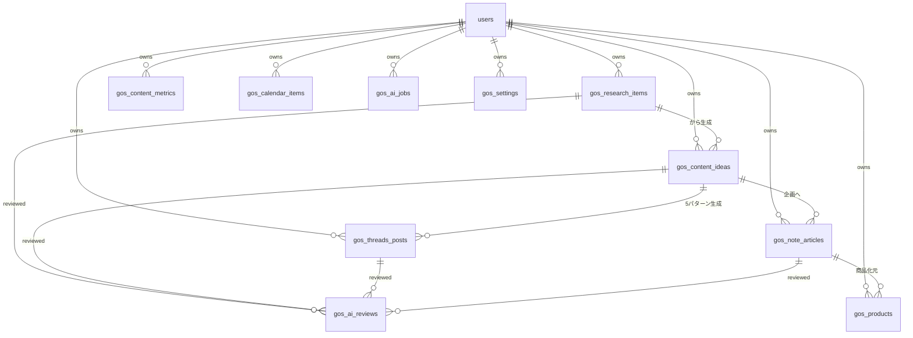

# note Growth OS データベース設計 (gos_ プレフィックス)

対応するSQLは [`migrations/20260914000000_growth_os_schema.sql`](./migrations/20260914000000_growth_os_schema.sql) を参照。

`public.users`（YATTORUと共有、`auth.users`と1:1）を所有者として、`gos_` プレフィックスの10テーブルで構成する。テーブル名を分離しているのは、将来このプロダクトだけを別リポジトリ/別Supabaseプロジェクトへ切り出す場合の移行コストを下げるため。

## ER図

## テーブル概要

| テーブル | 役割 |
|---|---|
| `gos_research_items` | 市場調査メモ。`harm_type`は単一分類ではなく`text[]`にし、「会社依存」のような複合的な悩みを複数区分(Health/Ambition/Relation/Money)に跨って表現する。 |
| `gos_content_ideas` | 9軸スコアリング済みのコンテンツ候補。`total_score`から`tier`（TOP/CANDIDATE/HOLD/REJECT）を生成列として自動算出。 |
| `gos_threads_posts` | 1テーマから生成される5パターン（共感/問題提起/失敗談/問いかけ/逆張り）とトーン評価。 |
| `gos_note_articles` | note記事本体とAIパイプラインの進捗。`revision_count`はDB制約で0〜3に強制し、無限ループを防ぐ。 |
| `gos_ai_reviews` | 13種のAgentごとの評価履歴。追記のみ・上書き禁止（UPDATE/DELETEポリシーを定義しない）。 |
| `gos_products` | 商品化提案（アウトライン込み）。 |
| `gos_content_metrics` | Threads/note/商品の日次成果スナップショット。`theme_tag`でテーマ別集計。 |
| `gos_calendar_items` | Threads/note/商品発売の横断予定。`sort_order`は将来のドラッグ&ドロップ用に予約。 |
| `gos_ai_jobs` | Agent実行の非同期ジョブキュー。`gos_dequeue_next_job()`が`FOR UPDATE SKIP LOCKED`で排他的に1件取り出す。 |
| `gos_settings` | スコア重み・プロンプト・AI予算上限などのユーザー単位KVストア。 |

## RLS方針

既存スキーマと同じ「本人の行のみ」パターン。`gos_ai_reviews`のみ監査証跡として参照・追加のみ許可し、更新・削除ポリシーは定義しない（デフォルトで拒否）。

## ジョブキューと再試行制御

- `gos_ai_jobs.attempt_count` / `max_attempts`：Claude API呼び出し自体の失敗に対するリトライ管理（既定3回）。
- `gos_note_articles.revision_count`：品質スコアによる書き直しループの回数（DB制約で0〜3に上限）。3回到達時点でスコア未達でも`quality_below_threshold = true`を立てて`WAITING_APPROVAL`へ強制遷移し、人間が最終判断する。
- 上記2つは別概念として分離管理する。
