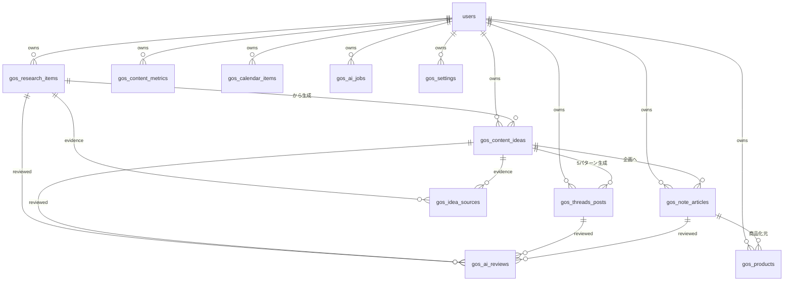

# note Growth OS データベース設計 (gos_ プレフィックス)

対応するSQLは [`migrations/20260914000000_growth_os_schema.sql`](./migrations/20260914000000_growth_os_schema.sql)（初期スキーマ）と
[`migrations/20260921000000_growth_os_theme_engine.sql`](./migrations/20260921000000_growth_os_theme_engine.sql)（フェーズ2: 収益テーマ発掘エンジン向けの再設計）を参照。

`public.users`（YATTORUと共有、`auth.users`と1:1）を所有者として、`gos_` プレフィックスの11テーブルで構成する。テーブル名を分離しているのは、将来このプロダクトだけを別リポジトリ/別Supabaseプロジェクトへ切り出す場合の移行コストを下げるため。

## フェーズ2での変更点

- `gos_research_items`: `source`→`source_name`に改名し`source_type`を追加、`target_age`(自由記述)を`target_age_min`/`target_age_max`に置き換え、`raw_text`/`surface_problem`/`deep_problem`/`emotional_trigger`/`collected_at`/`content_hash`/`analysis_version`/`last_analyzed_at`を追加。
- `gos_content_ideas`: 9軸スコアを`score_breakdown`(jsonb)から実カラム(`demand_score`等)へ変更し、`total_score`は9軸の合計を表す生成列に変更(旧`tier`生成列は削除、代わりにアプリ層`lib/growth-os/scoring.ts`の`scoreBand()`が表示用ラベルを算出)。`hook`/`angle`/`target_persona`/`core_problem`/`harm_types`/`recommended_format`/`recommended_free_or_paid`/`confidence_score`/`evidence_count`/`source_count`/`freshness_score`/`duplicate_score`/`most_similar_idea_id`を追加。`status`enumを`NEW/PRIORITY/CANDIDATE/HOLD/APPROVED/REJECTED`に変更(旧`APPROVED_FOR_THREADS`等は廃止)。
- `gos_idea_sources`(新規): Ideaが根拠にしたResearchとの多対多対応表(Evidence)。1つのIdeaが複数Researchを根拠にできる。
- `gos_ai_jobs`: `error`→`error_message`に改名、`model`/`input_tokens`/`output_tokens`/`estimated_cost`/`started_at`/`completed_at`を追加(AIコスト管理)。
- `gos_ai_reviews.agent_type`に`IDEA_GENERATOR`を追加。

## ER図

## テーブル概要

| テーブル | 役割 |
|---|---|
| `gos_research_items` | 市場調査メモ。`harm_types`は単一分類ではなく`text[]`にし、「会社依存」のような複合的な悩みを複数区分(Health/Ambition/Relation/Money)に跨って表現する。AIが`surface_problem`/`deep_problem`/`emotional_trigger`を抽出する。 |
| `gos_content_ideas` | 9軸スコア(実カラム)+`total_score`(生成列、9軸の合計)を持つコンテンツ候補。`confidence_score`等でAIの自己申告点数を鵜呑みにしない設計(セクション4)。表示用の帯ラベル(最優先候補/制作候補/保留候補/低優先)はDBではなくアプリ層で算出する。 |
| `gos_idea_sources` | Ideaの根拠となったResearchとのEvidence対応表(多対多)。 |
| `gos_threads_posts` | 1テーマから生成される5パターン（共感/問題提起/失敗談/問いかけ/逆張り）とトーン評価。 |
| `gos_note_articles` | note記事本体とAIパイプラインの進捗。`revision_count`はDB制約で0〜3に強制し、無限ループを防ぐ。 |
| `gos_ai_reviews` | 13種のAgentごとの評価履歴。追記のみ・上書き禁止（UPDATE/DELETEポリシーを定義しない）。 |
| `gos_products` | 商品化提案（アウトライン込み）。 |
| `gos_content_metrics` | Threads/note/商品の日次成果スナップショット。`theme_tag`でテーマ別集計。 |
| `gos_calendar_items` | Threads/note/商品発売の横断予定。`sort_order`は将来のドラッグ&ドロップ用に予約。 |
| `gos_ai_jobs` | Agent実行の非同期ジョブキュー。`gos_dequeue_next_job()`が`FOR UPDATE SKIP LOCKED`で排他的に1件取り出す。 |
| `gos_settings` | スコア重み・プロンプト・AI予算上限などのユーザー単位KVストア。 |

## RLS方針

既存スキーマと同じ「本人の行のみ」パターン。`gos_ai_reviews`のみ監査証跡として参照・追加のみ許可し、更新・削除ポリシーは定義しない（デフォルトで拒否）。

## ジョブキューと再試行制御

- `gos_ai_jobs.attempt_count` / `max_attempts`：Claude API呼び出し自体の失敗に対するリトライ管理（既定3回）。
- `gos_note_articles.revision_count`：品質スコアによる書き直しループの回数（DB制約で0〜3に上限）。3回到達時点でスコア未達でも`quality_below_threshold = true`を立てて`WAITING_APPROVAL`へ強制遷移し、人間が最終判断する。
- 上記2つは別概念として分離管理する。
