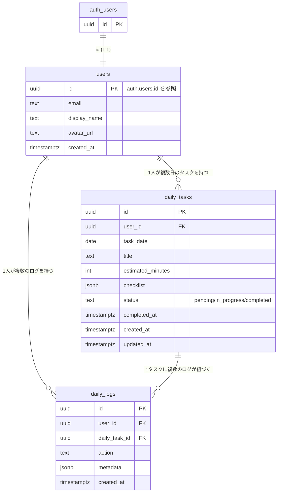

# YATTORU データベース設計 (users / daily_tasks / daily_logs)

対応するSQLは [`migrations/20260722000000_init_schema.sql`](./migrations/20260722000000_init_schema.sql) を参照。

## ER図

## テーブル概要

### users
`auth.users` と1:1で対応するプロフィールテーブル。Supabase Authはユーザーの追加カラムを直接持てないため、`id`を`auth.users.id`への参照として持つ別テーブルを用意している。行は`auth.users`への新規登録時にトリガー (`handle_new_user`) が自動作成するため、アプリケーション側からのINSERTは不要。

### daily_tasks
ユーザーに割り当てられる「その日1つのタスク」を表す。`(user_id, task_date)`に一意制約があり、1ユーザー1日1タスクを保証する。`checklist`は`[{ "id": "theme", "label": "テーマ決定", "done": false }, ...]`形式のJSONBで、チェックリストの項目と完了状態をまとめて保持する。

### daily_logs
`daily_tasks`に対するユーザーの行動履歴（チェック項目の完了、タスク完了など）を追記していくログテーブル。`action`に行動種別（例: `checklist_item_completed`, `task_completed`）、`metadata`に付随情報（例: `{"item_id": "theme"}`）をJSONBで保持する。

## RLS方針

全テーブルでRLSを有効化し、`auth.uid()`が行の所有者と一致する場合のみアクセスを許可する。

| テーブル | select | insert | update | delete |
|---|---|---|---|---|
| users | 本人のみ | 不可（トリガー経由のみ） | 本人のみ | 不可 |
| daily_tasks | 本人のみ | 本人のみ | 本人のみ | 本人のみ |
| daily_logs | 本人のみ | 本人のみ | 不可（追記のみ） | 不可（追記のみ） |

---

## AI Company OS (Phase 1) — `20260913000000_ai_company_os_phase1.sql`

YATTORU用の上記3テーブルとは独立した、Multi-Tenant「AI Company Operating System」用スキーマ。
詳細は migration ファイル本体のコメントを参照。要点のみここに記す。

### テナンシー

- `tenants` / `memberships` (`tenant_id, user_id, role`) が全ての起点。
- 新規ユーザーが `public.users` に作成される度に `handle_new_tenant_for_user()` トリガーが発火し、
  そのユーザー専用の `tenants` 行(role=`owner`)・部署4つ・AI社員14体・部署配属を自動生成する。
- `tenant_id` はアプリケーションコードからは信用しない。サーバー側で認証済みセッション→
  `memberships` を引いて解決した値のみを使う（`lib/server/tenant.ts`）。

### エンティティ

Organization: `departments` / `agents` / `agent_department_assignments`
Sales: `clients` / `leads` / `opportunities` / `contracts`
Delivery: `projects` / `goals` / `kpis` / `project_team_members` / `initiatives` / `findings` / `tasks` / `deliverables`
Approval: `approval_requests`（全ドメイン共通）/ `decision_memories`
Workflow: `workflow_runs` / `workflow_checkpoints` / `workflow_checkpoint_writes`（LangGraph.js用カスタムCheckpointerの永続化先）/ `agent_runs` / `agent_events` / `tool_calls`

### RLS方針

- `public.is_tenant_member(tenant_id)` / `public.has_tenant_role(tenant_id, roles[])` という
  `security definer` 関数を全テーブルのRLSポリシーで共通利用。
- 業務テーブルは「同一テナントのmembershipを持つユーザーのみselect/insert/update」。deleteのみ
  `owner`/`ceo`/`admin`ロールに限定。
- `approval_requests` はselect/insertを全メンバーに許可しつつ、承認・却下（update）は
  `owner`/`ceo`/`admin`ロールのみに制限（営業・契約・納品で承認テーブルを分けない）。
- `decision_memories` は追記のみ（update/deleteポリシーなし）。
- ローカルPostgres(16)で `auth.users`/`auth.uid()` をモックし、以下を実機検証済み:
  - 新規ユーザー2名がそれぞれ独立したテナント・部署・AI社員一式を持つこと
  - 別テナントの`agents`/`tenants`が`select`で一切見えないこと（テナント分離）
  - 他テナントの`tenant_id`を指定した`insert`がRLS違反として拒否されること（IDOR対策）

---

## AI Sales Department (Phase 3) — `20260915000000_ai_sales_department_phase3.sql`

Lead Discovery & Sales Intelligence。**テーブル分割を避け、既存の汎用テーブルへ極力寄せている**点が設計上の要点。

### 意図的に新規テーブルを作らなかったもの

- 企業調査・成長シグナル・簡易サイト診断 → すべて既存`findings`を再利用（`type`列で `company_research` / `growth_signal` / `website_diagnosis_lite` を区別）
- Sales Discovery Run → 新テーブルを作らず既存`workflow_runs`を再利用
  (`graph_name='lead_discovery_graph'`, `subject_type='sales_discovery_run'`)。
  予算・カウンタ・生成した検索戦略は`state` jsonbに保持。
- `sales_target_profiles`とICPは同一概念のため`icp_profiles`1本に統合。
- 重複判定結果はLeadに1件しか持たないため`leads.duplicate_status` /
  `duplicate_of_lead_id`列に直接保持（`lead_duplicates`テーブルは作らない）。
- Recommended ServicesとSales Hypothesisは常に1組で生成されるため
  `lead_sales_hypotheses`1本に統合。

### 新規テーブル

`icp_profiles`（Sales Target + ICP + スコア重み + 閾値）/ `do_not_contact` /
`lead_scores`（多軸スコア内訳をjsonbで保持、`score_version`付き）/
`lead_sales_hypotheses` / `sales_drafts`（送信は行わない下書きのみ）。

### `leads`への追加列

`domain` / `normalized_company_name` / `normalized_domain` / `region` /
`source_type` / `source_url` / `source_name` / `discovered_at` /
`duplicate_status` / `duplicate_of_lead_id` / `discovery_stage`
（Phase 1の`status`列とは独立。既存Phase 1フローに一切影響しない）/
`icp_profile_id` / `score_version` / `ai_cost_yen` / `test_mode` /
`last_verified_at`。

### Agentロースター

`handle_new_tenant_for_user()`に `scorer`(Lead Scoring) / `writer`(Sales Writer)
を追加し、**既存テナントにも同一migration内でバックフィル**（ローカルPostgresで
「Phase3適用前に作成済みのテナントが14→16エージェントになり、営業部へ自動配属
されること」を実機検証済み）。

### RLS

新規5テーブルすべて`is_tenant_member`/`has_tenant_role`パターンを踏襲。
他テナントの`tenant_id`を指定した`icp_profiles`への`insert`がRLS違反で
拒否されることを実機検証済み。

---

## AI Sales Execution (Phase 4) — `20260917000000_ai_sales_execution_phase4.sql`

Outreach送信・返信・商談・提案/見積・交渉・受注/失注。Phase3同様、**テーブル分割の抑制**を継続。

### 意図的に新規テーブルを作らなかったもの

- メール本文構造・送信ステータス・返信分類・スレッド紐付けは、すべて`sales_messages`
  1テーブルのカラムとして持つ（指示書§14の「共通テーブル」要件どおり）。
- 商談参加者・アジェンダ・議事録は`meetings`のjsonbカラム(`participants`/`agenda`/`minutes`)。
  Action Itemsも`meetings.minutes.actionItems`に保持し、`meeting_action_items`テーブルは作らない
  （`tasks.project_id`がNOT NULLで、WON前はprojectが存在しないため）。
- Proposal/Estimateのバージョン管理は`version integer` + `previous_version_id`自己参照。
  `proposal_versions`/`estimate_versions`という履歴テーブルは作らない。
- 交渉での相手の反応は既存`findings`を再利用（`type='negotiation_item'`）。
  `negotiation_items`テーブルは作らない。
- Opportunityのステージ変化履歴は既存`agent_events`を再利用
  （`event_type='opportunity.stage_changed'`）。`opportunity_stage_history`テーブルは作らない。
- 最終的な「受注(WON)確定」は、Phase1で既に実装済みの`sales_outreach`承認タイプの
  確定ロジック（`sales_graph`→`contract_graph`）を`finalizeWonAndStartContract()`として
  共通関数に抽出し、新しい`deal_won`承認タイプからも同じ関数を呼ぶ形で再利用。
  Contract Workflow側には一切手を入れていない。

### 新規テーブル

`sales_conversations` / `sales_messages`（構造化メール本文＋送信冪等性キー＋返信分類）/
`meetings` / `proposals` / `estimates` / `service_catalog`（価格マスタ）/
`external_action_logs`（Email送信・Calendar作成・Proposal送付の監査ログ、
`performed_by_user_id`は必ず人間）。

### `opportunities`への追加列

`probability` / `estimated_value` / `confirmed_value` / `expected_close_date` /
`owner_user_id` / `services` / `decision_maker` / `budget` / `need` / `timeline` /
`next_action` / `next_action_date` / `qualification`（MEDDIC/BANT等を将来変更できる
ようjsonbで保持）/ `lost_reason` / `lost_detail` / `ai_cost_yen` / `test_mode`。
`stage`はPhase1から存在する列（旧`'candidate'`固定）に新しいcheck制約を追加し、
既存の値を壊さず拡張。

### 送信冪等性・二重送信防止（実機検証済み）

`sales_messages`に`unique (tenant_id, idempotency_key)`制約を追加。ローカルPostgresで
同一`idempotency_key`の2回目`insert`が一意制約違反で拒否されることを確認。実際の
Final Send Gate（APIルート）はSENTへの状態遷移を`update ... where status='READY_TO_SEND'`
という単一の条件付きUPDATEとして実装しており、同時クリックの2回目は0行更新となって
安全に失敗する。

### Agentロースター

`handle_new_tenant_for_user()`に`outreach`/`analyst`/`meeting`/`proposal`/`estimate`/
`negotiator`の6エージェント（`capabilities` jsonbに機能タグ付き）を追加し、既存テナントにも
同一migration内でバックフィル。ローカルPostgresで「Phase4適用前のテナントが16→22エージェント
になり、営業部へ自動配属され、価格マスタ4件が投入されること」を実機検証済み。

### RLS

新規7テーブルすべて`is_tenant_member`/`has_tenant_role`パターンを踏襲。RLS有効化・
ポリシー数(各4件)をローカルPostgresで確認済み。

---

## Production Sales Operations (Phase 5) — 3 migrations

`20260919000000_production_sales_ops_phase5.sql` / `20260921000000_approval_snapshot_invalidation.sql` /
`20260922000000_file_security_and_delivery.sql`。Phase3-4同様、**テーブル分割の抑制**を継続しつつ、
「Human Confirm/重複検知/Task追跡性」など第一級の行が本当に必要な箇所だけ新規テーブルにしている。

### 意図的に新規テーブルを作らなかったもの

- Proposal/Estimateの「不変バージョン管理」は、既存の`proposals`/`estimates`
  （Phase4から既に1行=1バージョンで`version`/`previous_version_id`を持つ）に
  `content_json`/`snapshot_hash`/`change_summary`を追加し、`APPROVED`/`SENT`/`ACCEPTED`
  到達後の内容変更をトリガーで拒否する形で実現。`proposal_versions`/`estimate_versions`
  という履歴テーブルは作らない。
- Manager Approval Queue（Manager/CEOの承認チェーン）は既存`approval_requests`に
  `steps` jsonb配列 + `current_step`を追加するのみ。`approval_steps`という別テーブルは
  作らない — 1つの承認リクエストの生涯は既存の1行で表現できる。
- Approval Snapshot Hash / SLA も同様に`approval_requests`への列追加
  (`snapshot_hash`/`expires_at`/`sla_due_at`/`sla_status`/`policy_code`)のみ。

### 新規テーブル（本当に別エンティティのため）

`integration_connections` / `oauth_states`（Google OAuth。トークンは暗号化文字列のみ保持し、
生のトークンを直接持つ列は存在しない）/ `meeting_action_items`（Phase4は`meetings.minutes.actionItems`
のjsonbのみだったが、本フェーズのHuman Confirm状態遷移・重複検知・Task追跡には第一級の行が必要）/
`generated_files`（`file_data bytea` — このサンドボックスには外部オブジェクトストレージが存在しないため
Postgres列に直接バイト列を保存。`storage_path`は将来S3/GCS移行時に使う論理名として保持）/
`delivery_packages` / `file_access_logs`（ダウンロード/共有リンク発行の監査ログ。外部の署名付きリンク
経由のダウンロードは`performed_by_user_id`が`null`になる唯一のケース — 人間のテナントユーザーが
存在しないため。2本目のmigrationで`not null`制約を外した）/ `approval_policies`（データ駆動の承認
ポリシー: `conditions` jsonb + `steps` jsonb）/ `business_calendars` / `business_calendar_holidays` /
`sla_policies` / `followup_candidates`（人間が確認するまで絶対に送信しないFollow-up候補）/
`background_jobs`（RLS有効・ポリシー0件 = service-roleクライアント専用。`/api/cron/*`と
`/api/files/download`の2箇所のみがservice-roleを使う、明示的かつ限定的な例外）。

### `memberships`への変更

`role`のcheck制約に`'manager'`を追加（`owner`/`ceo`/`admin`/`manager`/`member`）。

### 実機検証済みの内容（ローカルPostgres 16）

- 6migration全体を順番に適用してエラーが出ないこと。
- `proposals`/`estimates`の不変性トリガー: `status`が`APPROVED`/`SENT`/`ACCEPTED`の行への
  内容列の`UPDATE`が例外で拒否され、`status`のみの更新は成功すること。
- `sales_messages.status`に新しい値`APPROVAL_INVALIDATED`が受理され、無関係な不正値は
  引き続き拒否されること。
- `file_access_logs.performed_by_user_id`に`null`を挿入できること（外部署名リンクの
  ダウンロード記録を模擬）。

### RLS

新規テーブルすべて既存パターン（`is_tenant_member`/`has_tenant_role`、または
`integration_connections`/`oauth_states`のような「本人のみ」パターン）を踏襲。
`background_jobs`のみRLS有効・ポリシー0件（service-role専用）。
