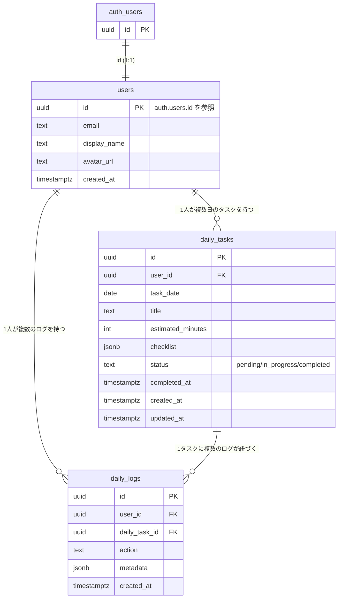

# YATTORU データベース設計 (users / daily_tasks / daily_logs)

対応するSQLは [`migrations/20260722000000_init_schema.sql`](./migrations/20260722000000_init_schema.sql) を参照。

## ER図

## テーブル概要

### users
`auth.users` と1:1で対応するプロフィールテーブル。Supabase Authはユーザーの追加カラムを直接持てないため、`id`を`auth.users.id`への参照として持つ別テーブルを用意している。行は`auth.users`への新規登録時にトリガー (`handle_new_user`) が自動作成するため、アプリケーション側からのINSERTは不要。

### daily_tasks
ユーザーに割り当てられる「その日1つのタスク」を表す。`(user_id, task_date)`に一意制約があり、1ユーザー1日1タスクを保証する。`checklist`は`[{ "id": "theme", "label": "テーマ決定", "done": false }, ...]`形式のJSONBで、チェックリストの項目と完了状態をまとめて保持する。

### daily_logs
`daily_tasks`に対するユーザーの行動履歴（チェック項目の完了、タスク完了など）を追記していくログテーブル。`action`に行動種別（例: `checklist_item_completed`, `task_completed`）、`metadata`に付随情報（例: `{"item_id": "theme"}`）をJSONBで保持する。

## RLS方針

全テーブルでRLSを有効化し、`auth.uid()`が行の所有者と一致する場合のみアクセスを許可する。

| テーブル | select | insert | update | delete |
|---|---|---|---|---|
| users | 本人のみ | 不可（トリガー経由のみ） | 本人のみ | 不可 |
| daily_tasks | 本人のみ | 本人のみ | 本人のみ | 本人のみ |
| daily_logs | 本人のみ | 本人のみ | 不可（追記のみ） | 不可（追記のみ） |

---

## AI Company OS (Phase 1) — `20260913000000_ai_company_os_phase1.sql`

YATTORU用の上記3テーブルとは独立した、Multi-Tenant「AI Company Operating System」用スキーマ。
詳細は migration ファイル本体のコメントを参照。要点のみここに記す。

### テナンシー

- `tenants` / `memberships` (`tenant_id, user_id, role`) が全ての起点。
- 新規ユーザーが `public.users` に作成される度に `handle_new_tenant_for_user()` トリガーが発火し、
  そのユーザー専用の `tenants` 行(role=`owner`)・部署4つ・AI社員14体・部署配属を自動生成する。
- `tenant_id` はアプリケーションコードからは信用しない。サーバー側で認証済みセッション→
  `memberships` を引いて解決した値のみを使う（`lib/server/tenant.ts`）。

### エンティティ

Organization: `departments` / `agents` / `agent_department_assignments`
Sales: `clients` / `leads` / `opportunities` / `contracts`
Delivery: `projects` / `goals` / `kpis` / `project_team_members` / `initiatives` / `findings` / `tasks` / `deliverables`
Approval: `approval_requests`（全ドメイン共通）/ `decision_memories`
Workflow: `workflow_runs` / `workflow_checkpoints` / `workflow_checkpoint_writes`（LangGraph.js用カスタムCheckpointerの永続化先）/ `agent_runs` / `agent_events` / `tool_calls`

### RLS方針

- `public.is_tenant_member(tenant_id)` / `public.has_tenant_role(tenant_id, roles[])` という
  `security definer` 関数を全テーブルのRLSポリシーで共通利用。
- 業務テーブルは「同一テナントのmembershipを持つユーザーのみselect/insert/update」。deleteのみ
  `owner`/`ceo`/`admin`ロールに限定。
- `approval_requests` はselect/insertを全メンバーに許可しつつ、承認・却下（update）は
  `owner`/`ceo`/`admin`ロールのみに制限（営業・契約・納品で承認テーブルを分けない）。
- `decision_memories` は追記のみ（update/deleteポリシーなし）。
- ローカルPostgres(16)で `auth.users`/`auth.uid()` をモックし、以下を実機検証済み:
  - 新規ユーザー2名がそれぞれ独立したテナント・部署・AI社員一式を持つこと
  - 別テナントの`agents`/`tenants`が`select`で一切見えないこと（テナント分離）
  - 他テナントの`tenant_id`を指定した`insert`がRLS違反として拒否されること（IDOR対策）

---

## AI Sales Department (Phase 3) — `20260915000000_ai_sales_department_phase3.sql`

Lead Discovery & Sales Intelligence。**テーブル分割を避け、既存の汎用テーブルへ極力寄せている**点が設計上の要点。

### 意図的に新規テーブルを作らなかったもの

- 企業調査・成長シグナル・簡易サイト診断 → すべて既存`findings`を再利用（`type`列で `company_research` / `growth_signal` / `website_diagnosis_lite` を区別）
- Sales Discovery Run → 新テーブルを作らず既存`workflow_runs`を再利用
  (`graph_name='lead_discovery_graph'`, `subject_type='sales_discovery_run'`)。
  予算・カウンタ・生成した検索戦略は`state` jsonbに保持。
- `sales_target_profiles`とICPは同一概念のため`icp_profiles`1本に統合。
- 重複判定結果はLeadに1件しか持たないため`leads.duplicate_status` /
  `duplicate_of_lead_id`列に直接保持（`lead_duplicates`テーブルは作らない）。
- Recommended ServicesとSales Hypothesisは常に1組で生成されるため
  `lead_sales_hypotheses`1本に統合。

### 新規テーブル

`icp_profiles`（Sales Target + ICP + スコア重み + 閾値）/ `do_not_contact` /
`lead_scores`（多軸スコア内訳をjsonbで保持、`score_version`付き）/
`lead_sales_hypotheses` / `sales_drafts`（送信は行わない下書きのみ）。

### `leads`への追加列

`domain` / `normalized_company_name` / `normalized_domain` / `region` /
`source_type` / `source_url` / `source_name` / `discovered_at` /
`duplicate_status` / `duplicate_of_lead_id` / `discovery_stage`
（Phase 1の`status`列とは独立。既存Phase 1フローに一切影響しない）/
`icp_profile_id` / `score_version` / `ai_cost_yen` / `test_mode` /
`last_verified_at`。

### Agentロースター

`handle_new_tenant_for_user()`に `scorer`(Lead Scoring) / `writer`(Sales Writer)
を追加し、**既存テナントにも同一migration内でバックフィル**（ローカルPostgresで
「Phase3適用前に作成済みのテナントが14→16エージェントになり、営業部へ自動配属
されること」を実機検証済み）。

### RLS

新規5テーブルすべて`is_tenant_member`/`has_tenant_role`パターンを踏襲。
他テナントの`tenant_id`を指定した`icp_profiles`への`insert`がRLS違反で
拒否されることを実機検証済み。
