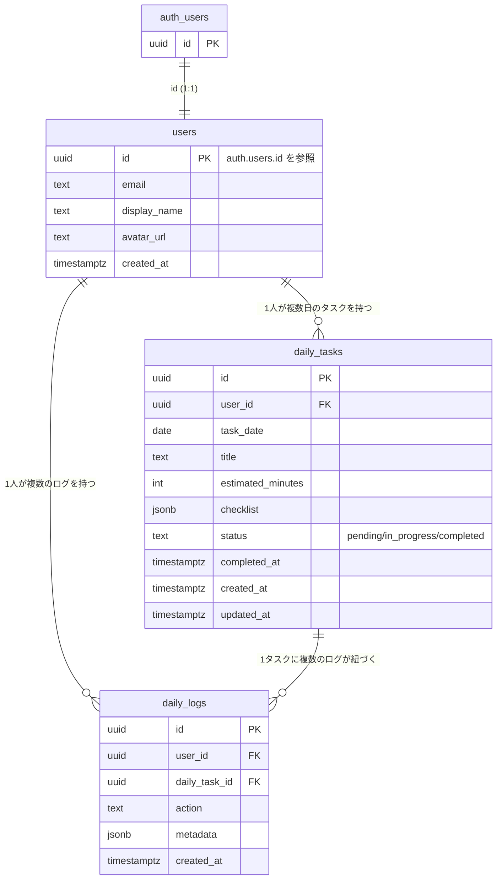

# YATTORU データベース設計 (users / daily_tasks / daily_logs)

対応するSQLは [`migrations/20260722000000_init_schema.sql`](./migrations/20260722000000_init_schema.sql) を参照。

## ER図

## テーブル概要

### users
`auth.users` と1:1で対応するプロフィールテーブル。Supabase Authはユーザーの追加カラムを直接持てないため、`id`を`auth.users.id`への参照として持つ別テーブルを用意している。行は`auth.users`への新規登録時にトリガー (`handle_new_user`) が自動作成するため、アプリケーション側からのINSERTは不要。

### daily_tasks
ユーザーに割り当てられる「その日1つのタスク」を表す。`(user_id, task_date)`に一意制約があり、1ユーザー1日1タスクを保証する。`checklist`は`[{ "id": "theme", "label": "テーマ決定", "done": false }, ...]`形式のJSONBで、チェックリストの項目と完了状態をまとめて保持する。

### daily_logs
`daily_tasks`に対するユーザーの行動履歴（チェック項目の完了、タスク完了など）を追記していくログテーブル。`action`に行動種別（例: `checklist_item_completed`, `task_completed`）、`metadata`に付随情報（例: `{"item_id": "theme"}`）をJSONBで保持する。

## RLS方針

全テーブルでRLSを有効化し、`auth.uid()`が行の所有者と一致する場合のみアクセスを許可する。

| テーブル | select | insert | update | delete |
|---|---|---|---|---|
| users | 本人のみ | 不可（トリガー経由のみ） | 本人のみ | 不可 |
| daily_tasks | 本人のみ | 本人のみ | 本人のみ | 本人のみ |
| daily_logs | 本人のみ | 本人のみ | 不可（追記のみ） | 不可（追記のみ） |
